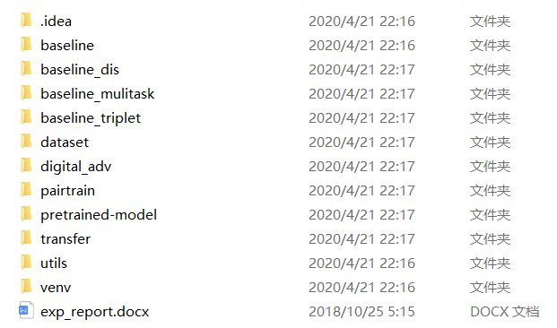

# 代码上传日志

- 2020-04-23

提交了学长原始的代码与~~模型~~，文件夹原名`rank-reid_linux`  ，现为`code_raw` 

内容排列如下，模型传到群里

- 2020-04-23

加上了`reid-security-analysis-system`的文件夹（RSAS），

里面有一个[pyecharts](https://pyecharts.org/) +`flask`的网站demo——`pyecharts-flask-demo`

# Other things……

